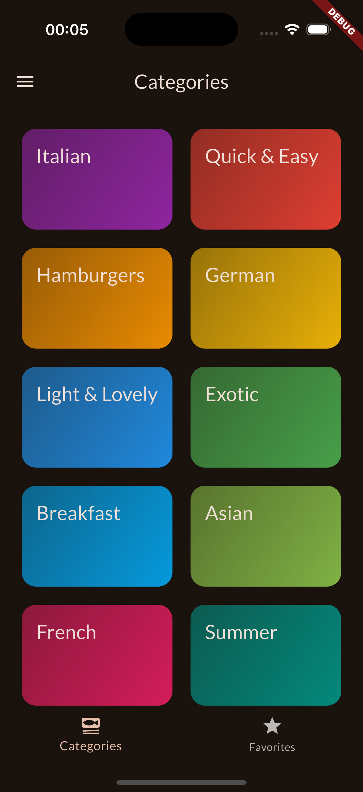
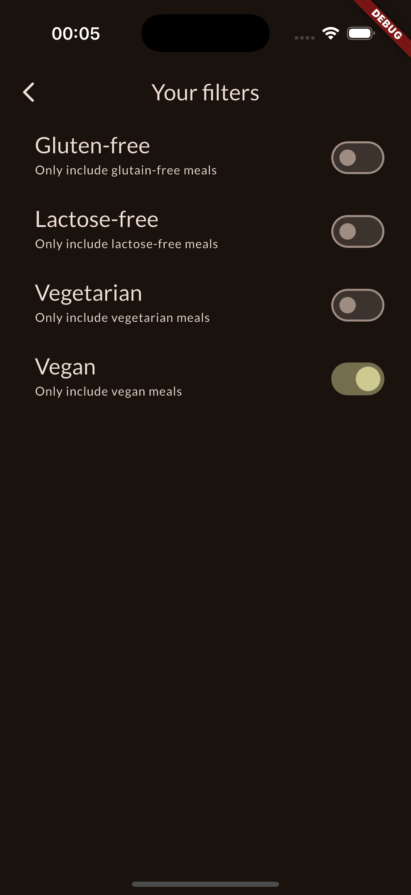
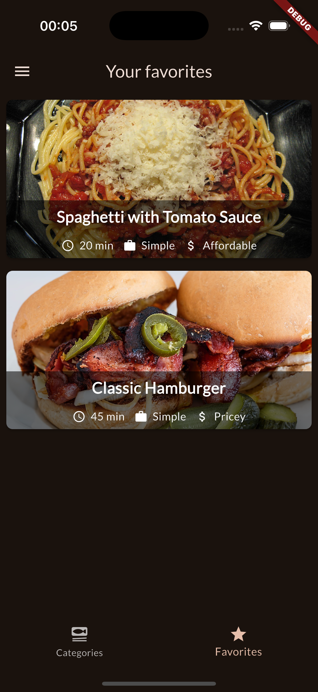
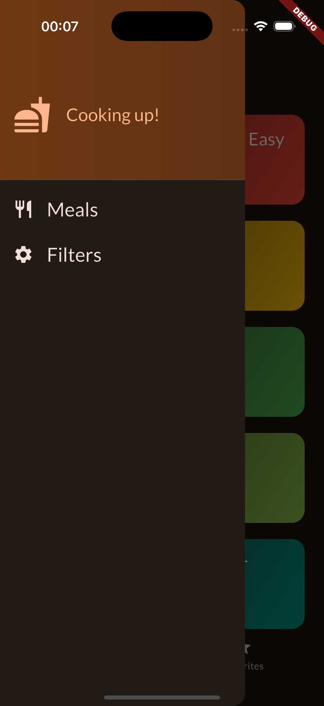

# Meals App

Um aplicativo de receitas interativo desenvolvido com Flutter e gerenciamento de estado usando Riverpod.

## 📱 Visão Geral

Meals App é um aplicativo de receitas que permite aos usuários navegar por diferentes categorias de alimentos, visualizar receitas detalhadas, marcar favoritos e aplicar filtros baseados em preferências alimentares.

## ✨ Funcionalidades

- **Navegação por Categorias:** Explore receitas organizadas em categorias como Italiana, Asiática, Hamburguers, etc.
- **Detalhes de Receitas:** Visualize ingredientes, passos, tempo de preparo e outras informações.
- **Favoritos:** Marque receitas como favoritas para acesso rápido.
- **Filtros Alimentares:** Filtre receitas baseado em preferências:
  - Sem Glúten
  - Sem Lactose
  - Vegano
  - Vegetariano
- **Interface Responsiva:** Design adaptável com animações fluidas.

## 🏗️ Arquitetura

### Gerenciamento de Estado
- Utiliza **Flutter Riverpod** para gerenciamento de estado eficiente.
- Implementa `StateNotifierProvider` para estado mutável (favoritos e filtros).
- Usa `Provider` para dados somente leitura.

### Estrutura do Projeto

```
lib/
├── data/
│   └── dummy_data.dart          # Dados de exemplo para receitas e categorias
├── models/
│   ├── category.dart            # Modelo para categorias
│   └── meal.dart                # Modelo para receitas
├── providers/
│   ├── favorites_provider.dart  # Gerenciamento dos favoritos
│   ├── filters_provider.dart    # Gerenciamento dos filtros
│   └── meals_provider.dart      # Provedor de dados das receitas
├── screens/
│   ├── categories_screen.dart   # Tela de categorias
│   ├── filter_screen.dart       # Tela de filtros
│   ├── meals_details_screen.dart # Detalhes da receita
│   ├── meals_screen.dart        # Lista de receitas
│   └── tabs_screen.dart         # Tela principal com tabs
└── widgets/
    ├── category_grid_item.dart  # Item do grid de categorias
    ├── main_drawer.dart         # Drawer principal
    ├── meal_item.dart           # Item de receita
    ├── meal_item_trait.dart     # Características da receita
    ├── meals_details_screen_list.dart  # Lista para tela de detalhes
    └── meals_details_screen_title.dart # Título para tela de detalhes
```

## 🚀 Como Executar

1. Certifique-se de ter o Flutter instalado e configurado
2. Clone este repositório
3. Instale as dependências:
   ```
   flutter pub get
   ```
4. Execute o aplicativo:
   ```
   flutter run
   ```

## 📦 Dependências

- [flutter_riverpod](https://pub.dev/packages/flutter_riverpod): Gerenciamento de estado
- [transparent_image](https://pub.dev/packages/transparent_image): Carregamento de imagens com fade-in

## 🎨 Estilo e Tema

O aplicativo utiliza o sistema de temas do Flutter e implementa:
- Gradientes personalizados para categorias
- Controles de navegação intuitivos
- Cores vibantes para cada categoria culinária
- Transparência para efeitos visuais usando `withValues(alpha: valor)`

## 📸 Screenshots

| Tela de Categorias | Detalhes da Receita | Filtros |
|:---:|:---:|:---:|
|  |  |  |
| **Tela de Favoritos** | **Drawer** | **Lista de Receitas** |
|  |  |  |
